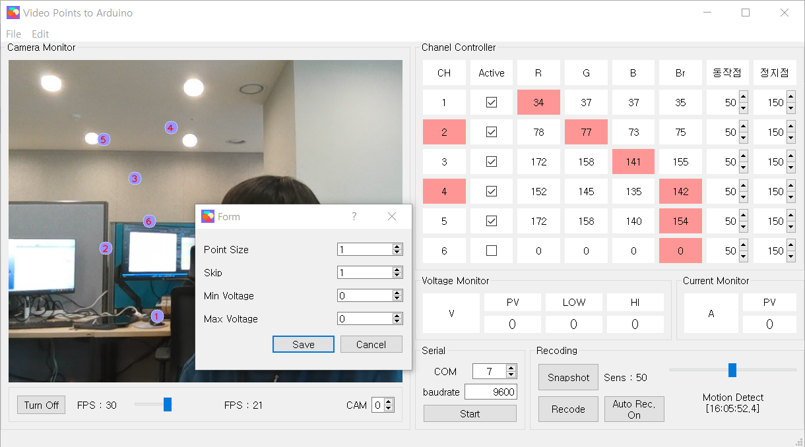
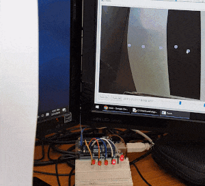

# Cam Points Monitoring

Set points interactively on camera view to monitor and evoke arduino pin out.

- Set up to 6 points to monitor and enable independantly.
- Each point has a adjustable range and outputs signal when the pixel value is in the range.
- 4 options on pixel value: Red, Green, Blue or Brightness.
- Keep recieving voltage and current values from arduino.
- Adaptable voltage range to warn.
- Serial communication with configurable port and baud rate.
- Selectable camera number and frame rates.
- Manual & motion-based snapshot or recording (adjustable sensitivity).

